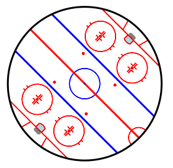
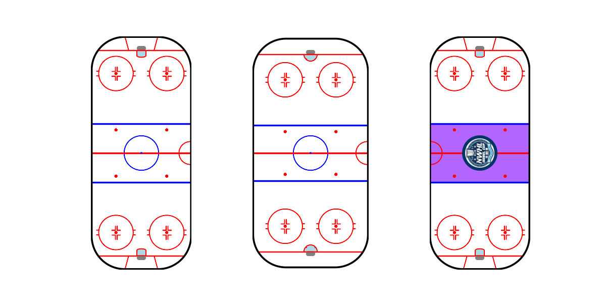
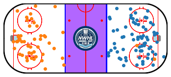
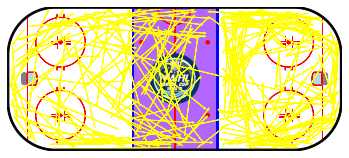
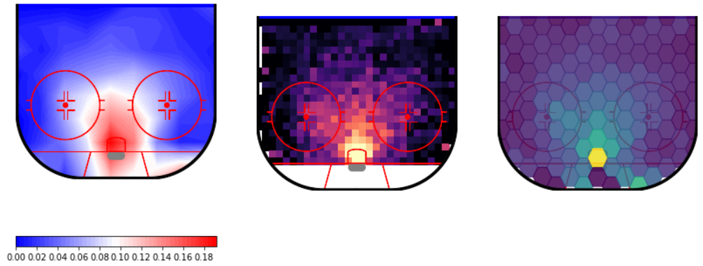

# Hockey Rink



A Python library for plotting hockey rinks with Matplotlib.

## Installation
```pip install hockey_rink```

## Current Rinks
The following shows the custom rinks currently available for plotting.

```
from hockey_rink import NHLRink, IIHFRink, NWHLRink
import matplotlib.pyplot as plt

fig, axs = plt.subplots(1, 3, sharey=True, figsize=(12, 6), gridspec_kw={"width_ratios": [1, 98.4/85, 1]})
nhl_rink = NHLRink(rotation=90)
iihf_rink = IIHFRink(rotation=90)
nwhl_rink = NWHLRink(rotation=90)
axs[0] = nhl_rink.draw(ax=axs[0])
axs[1] = iihf_rink.draw(ax=axs[1])
axs[2] = nwhl_rink.draw(ax=axs[2])
```



The NWHL logo comes from [the NWHL site](https://www.nwhl.zone/news/nwhl-unveils-isobel-cup-logo-for-2021-season).

## Customization
There is also room for customization.  The image at the top was created as follows:  
  
```rink = Rink(rotation=45, boards={"length": 150, "width": 150, "radius": 75})```

Rinks also allow for additional features to be added.  Custom features should inherit from RinkFeature and
override the _get_centered_xy method.  The draw method can also be overridden if the desired feature can't be drawn
with a matplotlib Polygon, though _get_centered_xy should still provide the feature's boundaries.  CircularImage
provides an example of this by inheriting from RinkCircle.

If a custom feature is to be constrained to only display within the rink, the returned object needs to have a 
set_clip_path method.

## Plots
There are currently wrappers available for the following Matplotlib plots:  
    - plot  
    - scatter  
    - arrow  
    - hexbin  
    - pcolormesh (heatmap in Hockey Rink)  
    - contour  
    - contourf  
    
If you'd like to bypass the wrappers, you can convert coordinates to the proper scale with convert_xy:  
  
```
rink = Rink()
x, y = rink.convert_xy(x, y)
```

When plotting to a partially drawn surface, the plot will be applied to the entire rink, not what's visible.  This can
be avoided by setting plot_range (or plot_xlim and plot_ylim) in the plotting functions where they're available.

It's also important to realize that the plotting functions only allow arguments to be passed without keywords for the
coordinates.  
ie) ```hexbin(x, y, values)``` will throw an error.

The correct call is ```hexbin(x, y, values=values)```

## Examples

Let's look at some NWHL data via the [Big Data Cup](https://www.stathletes.com/big-data-cup/).

The first game is Minnesota vs Boston, so we'll go with that and do a scatter plot of each team's shots.

```
from hockey_rink import NWHLRink
import pandas as pd

df = pd.read_csv("https://raw.githubusercontent.com/bigdatacup/Big-Data-Cup-2021/main/hackathon_nwhl.csv")
game_df = df.loc[(df["Home Team"] == "Minnesota Whitecaps") & (df["Away Team"] == "Boston Pride")]
shots = game_df.loc[(game_df.Event.isin(["Shot", "Goal"]))]
boston_shots = shots[shots.Team == "Boston Pride"]
minnesota_shots = shots[shots.Team == "Minnesota Whitecaps"]
rink = NWHLRink(x_shift=100, y_shift=42.5)
ax = rink.draw()
rink.scatter(boston_shots["X Coordinate"], boston_shots["Y Coordinate"])
rink.scatter(200 - minnesota_shots["X Coordinate"], 85 - minnesota_shots["Y Coordinate"])
```



Extending the example, let's look at all of Boston's passes.

```
boston_passes = game_df.loc[(game_df.Team == "Boston Pride") & (game_df.Event == "Play")]
ax.clear()
rink.draw()
arrows = rink.arrow(boston_passes["X Coordinate"], boston_passes["Y Coordinate"], 
                    boston_passes["X Coordinate 2"], boston_passes["Y Coordinate 2"], color="yellow")
```



For some of the other plots, let's look at some NHL shooting percentages.

To mix things up a little, binsize will take different values in each plot and the heatmap won't include shots from
below the goal line.  We'll also throw in a colorbar for the contour plot.
```
from hockey_rink import NHLRink
import matplotlib.pyplot as plt
import numpy as np
import pandas as pd

pbp = pd.read_csv("https://hockey-data.harryshomer.com/pbp/nhl_pbp20192020.csv.gz", compression="gzip")
pbp["goal"] = (pbp.Event == "GOAL").astype(int)
pbp["x"] = np.abs(pbp.xC)
pbp["y"] = pbp.yC * np.sign(pbp.xC)
shots = pbp.loc[(pbp.Ev_Zone == "Off") & ~pbp.x.isna() & ~pbp.y.isna() & (pbp.Event.isin(["GOAL", "SHOT", "MISS"]))]

fig, axs = plt.subplots(1, 3, figsize=(14, 8))
rink = NHLRink(rotation=270)
for i in range(3):
    rink.draw(ax=axs[i], display_range="ozone")
contour_img = rink.contourf(shots.x, shots.y, values=shots.goal, ax=axs[0], cmap="bwr", 
                            plot_range="ozone", binsize=10, levels=50, statistic="mean")
plt.colorbar(contour_img, ax=axs[0], orientation="horizontal")
rink.heatmap(shots.x, shots.y, values=shots.goal, ax=axs[1], cmap="magma",
             plot_xlim=(25, 89), statistic="mean", vmax=0.2, binsize=3)
rink.hexbin(shots.x, shots.y, values=shots.goal, ax=axs[2], binsize=(8, 12), plot_range="ozone", zorder=25, alpha=0.85)
```



## Inspiration
This project was partly inspired by [mplsoccer](https://github.com/andrewRowlinson/mplsoccer).

Hopefully, it can lower a barrier for someone looking to get involved in hockey analytics.

## Contact
You can find me on twitter [@the_bucketless](https://twitter.com/the_bucketless) or email me at thebucketless@protonmail.com if you'd like to get in touch.
