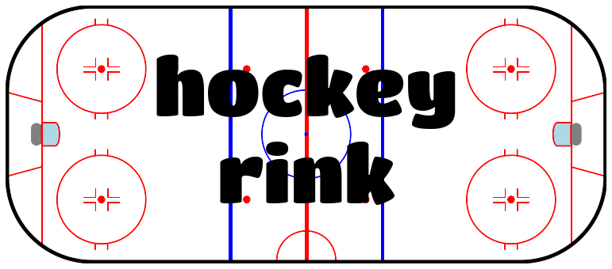
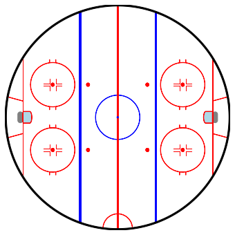
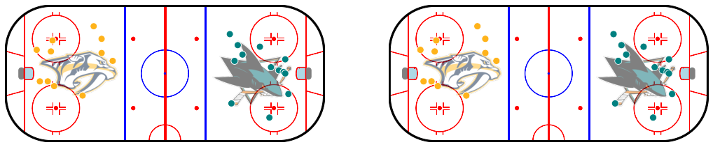
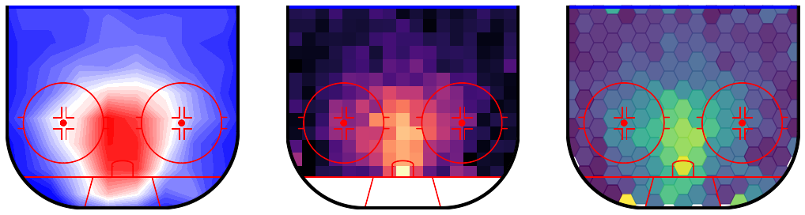
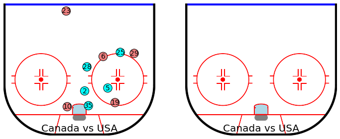

A Python library for plotting hockey rinks with Matplotlib.

## Installation
```pip install hockey-rink```

## Current Rinks

The following rinks are available for use:
- Rink
- NHLRink
- NWHLRink (from the 2021 Lake Placid games)
- IIHFRink
- OldIIHFRink

## Customization
There is also room for customization. For example, to change the dimension of a rink, update the length and/or width of the boards:

```
rink = Rink(boards={"length": 150, "width": 150, "radius": 75})
```
  


Each rink comes with a default set of features, but additional features can be added. Custom features should inherit 
from RinkFeature and override the _get_centered_xy method. The draw method can also be overridden if the desired feature can't be drawn
with a Matplotlib Polygon, though _get_centered_xy should still provide the feature's boundaries. The RinkImage
feature provides an example of this by inheriting from RinkRectangle.

If a custom feature is to be constrained to only display within the rink, the returned object needs to have a 
set_clip_path method.

## Plots
There are currently wrappers available for the following Matplotlib plotting methods:  
- plot  
- scatter  
- arrow  
- hexbin  
- pcolormesh (heatmap in hockey-rink)  
- contour  
- contourf  
- text
    
There's also a rink.plot_fn which will take as its first argument a plotting method from either Matplotlib or seaborn 
and will attempt to make the desired plot.
  
```
from hockey_rink import NHLRink, RinkImage
import matplotlib.pyplot as plt
import pandas as pd
import seaborn as sns

shots = (
    pd.read_parquet("https://github.com/sportsdataverse/fastRhockey-data/blob/main/nhl/pbp/parquet/play_by_play_2023.parquet?raw=true")
    .query("event_type in ('GOAL', 'SHOT', 'MISS')")
)

team_colors = {"San Jose Sharks": (0, 0.5, 0.5), "Nashville Predators": (1, 0.7, 0.1)}

rink = NHLRink(
    sharks_logo={
        "feature_class": RinkImage,
        "image_path": "https://upload.wikimedia.org/wikipedia/en/thumb/3/37/SanJoseSharksLogo.svg/330px-SanJoseSharksLogo.svg.png",
        "x": 55, "length": 50, "width": 42,
        "zorder": 15, "alpha": 0.5,
    },
    preds_logo={
        "feature_class": RinkImage,
        "image_path": "https://upload.wikimedia.org/wikipedia/en/thumb/9/9c/Nashville_Predators_Logo_%282011%29.svg/330px-Nashville_Predators_Logo_%282011%29.svg.png",
        "x": -55, "length": 50, "width": 29,
        "zorder": 15, "alpha": 0.5,
    }
)

first_period = shots.query("game_id == 2022020001 and period == 1")

fig, axs = plt.subplots(1, 2, figsize=(18, 8))
rink.scatter("x", "y", facecolor=first_period.event_team.map(team_colors), s=100, edgecolor="white", data=first_period, ax=axs[0])
rink.plot_fn(sns.scatterplot, x="x", y="y", hue="event_team", s=100, legend=False, data=first_period, ax=axs[1], palette=team_colors);
```


When using plots that require binning, it's often best to include a plot_range even when it isn't being used to 
find the bins. Here's an example using shooting percentage.

```
import numpy as np

ozone_shots = (
    shots
    .assign(
        is_goal=shots.event_type == "GOAL",
        x=np.abs(shots.x),
        y=shots.y * np.sign(shots.x),
    )
)

fig, axs = plt.subplots(1, 3, figsize=(18, 8))

rink = NHLRink(rotation=270, net={"visible": False})

rink.contourf(
    "x", "y", "is_goal", data=ozone_shots, 
    nbins=8, levels=30, plot_range="ozone", cmap="bwr",
    ax=axs[0], draw_kw={"display_range": "ozone"},
)

rink.heatmap(
    "x", "y", "is_goal", data=ozone_shots, 
    binsize=5, fill_value=0, plot_xlim=(25, 89), cmap="magma", vmax=0.25,
    ax=axs[1], draw_kw={"display_range": "ozone"},
)

rink.hexbin(
    "x", "y", "is_goal", data=ozone_shots,
    gridsize=(14, 8), plot_range="ozone", alpha=0.85, vmax=0.25,
    ax=axs[2], draw_kw={"display_range": "ozone"},
)
```


There's also a clear method which will attempt to remove anything that isn't part of the rink unless it's passed 
to the keep variable. This can be useful for animations.
```
df = (
    pd.read_csv("https://github.com/the-bucketless/bdc/raw/main/data/2022-02-08%20Canada%20at%20USA/2022-02-08%20Canada%20at%20USA%20P1%20PP1.csv")
    .query("frame_id == 400")
    .assign(team_color=lambda df_: np.where(df_.team_name == "Canada", "lightcoral", "aqua"))
)

rink = NHLRink(x_shift=100, y_shift=42.5, rotation=270)

fig, axs = plt.subplots(1, 2, figsize=(12, 8))
for ax in axs:
    rink.draw(display_range="ozone", ax=ax)
    
    rink.scatter(
        "x_ft", "y_ft", ax=ax,
        facecolor="team_color", edgecolor="black", s=300,
        data=df,
    )

    rink.text(
        "x_ft", "y_ft", "jersey_number", ax=ax,
        ha="center", va="center", fontsize=14, 
        data=df,
    )
    
    teams_text = rink.text(
        0.5, 0.05, "Canada vs USA", ax=ax,
        use_rink_coordinates=False,
        ha="center", va="center", fontsize=20,
    )

rink.clear(ax=axs[1], keep=[teams_text])
```


## Inspiration
This project was partly inspired by [mplsoccer](https://github.com/andrewRowlinson/mplsoccer).

Hopefully, it can make things a little easier for anyone looking to get involved in hockey analytics.

## Contact
You can find me on twitter [@the_bucketless](https://twitter.com/the_bucketless) or email me at thebucketless@protonmail.com.
