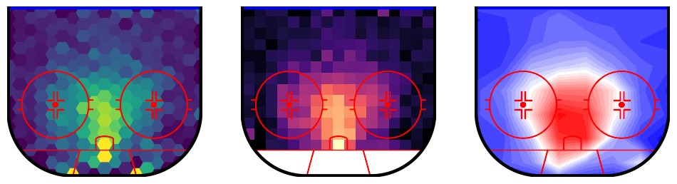

A Python library for plotting hockey rinks with Matplotlib.

## Installation
```pip install hockey-rink```

## Example Notebooks

### [Drawing](examples/drawing.ipynb)

This notebook shows how to customize rinks and draw them. This includes a dark-theme rink.  


### [Plotting](examples/plotting.ipynb)

Plotting is mainly done through wrappers for Matplotlib plotting methods. This notebook shows each of the currently available methods.  



### [Animating](examples/animating.ipynb)

The final example notebook shows how to use the package to make animations.


## Inspiration
This project was partly inspired by [mplsoccer](https://github.com/andrewRowlinson/mplsoccer).

Hopefully, it can make things a little easier for anyone looking to get involved in hockey analytics.

## Contact
You can find me on twitter [@the_bucketless](https://twitter.com/the_bucketless) or email me at thebucketless@protonmail.com.
